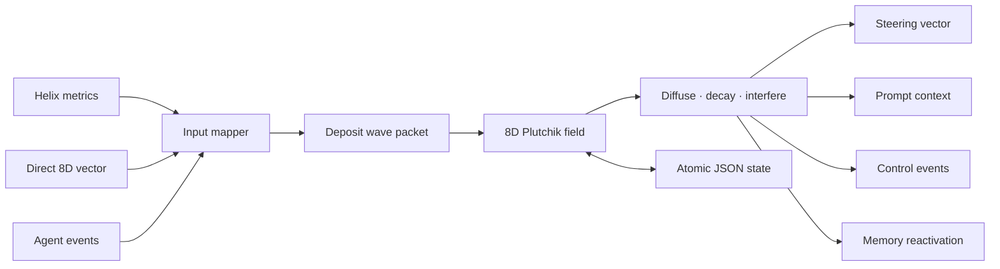

<div align="center">

# AIEASS

### AI Emotive Affect Simulation System

**A memory-shaped affective control layer for AI agents — local, deterministic, model-free, and agent-agnostic.**

[](https://github.com/munch2u-a11y/AI-Emotive-Affect-Simulation-System-AIEASS/actions/workflows/ci.yml)
[](https://www.python.org/)
[](https://modelcontextprotocol.io/)
[](#license)

[Quick start](#quick-start) · [How it works](#how-it-works) · [Integrations](#agent-integrations) · [API](#three-ways-to-drive-the-field) · [Caveats](#what-aieass-is-and-is-not)

</div>

---

AIEASS gives an AI agent a compact, evolving affect state without another LLM
call. Experiences become wave packets in an eight-dimensional Plutchik space.
Those packets diffuse, decay, interfere, retain memory associations, and
produce soft steering signals that a host can use for attention, tone,
engagement, or retrieval.

It runs on ordinary CPU hardware, stores no conversation text by default, and
works as a Python library, a language-neutral JSONL sidecar, or a local MCP
server.

> **Sentience-free by design.** AIEASS simulates a computational control state.
> It does not claim that a model feels emotions or possesses consciousness.

## Why AIEASS?

Most agents are affectively stateless: a success, failure, surprise, or long
period of stagnation disappears as soon as the context window moves on. AIEASS
adds continuity without retraining the model or handing emotional judgment to
another opaque classifier.

| Capability | What it gives the host agent |
|---|---|
| Eight-dimensional affect field | Joy, trust, fear, surprise, sadness, disgust, anger, and anticipation |
| Wave-packet memory | Earlier events persist, overlap, reinforce, or cancel over time |
| Deterministic dynamics | Reproducible results with no hidden API calls or model drift |
| Memory reactivation | Affectively related opaque memory IDs can resurface when packets resonate |
| Soft steering | A compact vector for attention, retrieval, tone, or planning biases |
| Portable inputs | Helix metrics, direct 8D vectors, or framework-neutral operational events |
| Drop-in transports | Native Python, JSONL over stdio, and MCP 2.x |
| Durable sessions | Thread-safe isolation and atomic on-disk persistence per agent/session |

## How it works



Each meaningful agent cycle follows the same atomic lifecycle:

```text
deposit → evolve → sample
```

The extracted compatibility profile preserves Helix-AGI's mapping, anisotropic
sigma expansion, importance-weighted amplitude decay, phase-coherent
interference, dominant-affect selection, diversity signal, and semantic memory
overlap behavior.

## Quick start

### 1. Install

```bash
git clone https://github.com/munch2u-a11y/AI-Emotive-Affect-Simulation-System-AIEASS.git
cd AI-Emotive-Affect-Simulation-System-AIEASS
python -m pip install -e .
```

For MCP support:

```bash
python -m pip install -e ".[mcp]"
```

Python 3.10 or newer is required. The core has **zero third-party runtime
dependencies**. Only the MCP transport installs an optional dependency.

### 2. Feed it an observable agent event

```python
from plutchik_wave import PlutchikWaveSystem

affect = PlutchikWaveSystem(state_path="./state/agent-affect.json")

update = affect.step_event(
    "goal_progress",
    magnitude=0.8,
    anchor_ids=["plan-v3"],
)

print(update["result"]["dominant_affect"])
print(update["result"]["steering_vector"])
print(update["context"])

affect.save_state()
```

Example context returned to the host:

```text
Affect control signal (computational state, not a claim of subjective feeling):
dominant=anticipation; anticipation=0.820, joy=0.660, trust=0.620;
diversity=0.000. Use this only as a soft attention/tone prior; task instructions
and safety rules take precedence.
```

### 3. Wire the outputs into your runtime

```python
def after_agent_cycle(cycle, affect, host):
    if cycle.tool_failed:
        update = affect.step_event("tool_failure", anchor_ids=[cycle.id])
    elif cycle.made_progress:
        update = affect.step_event("goal_progress", anchor_ids=[cycle.id])
    elif cycle.discovered_something_new:
        update = affect.step_event("novelty", anchor_ids=[cycle.id])
    else:
        update = affect.step_event("uncertainty", magnitude=0.25)

    host.attention_bias = update["result"]["steering_vector"]
    host.add_next_turn_context(update["context"])

    for event in update["events"]:
        host.emit(event)
```

Update once per meaningful cycle from observable signals. Do not ask the model
to invent a new emotional state for every token.

## Three ways to drive the field

### 1. Portable operational events

The easiest integration path:

```python
affect.step_event("tool_success", magnitude=0.9)
affect.step_event("blocked", anchor_ids=["issue-18"])
affect.step_event("risk_detected", magnitude=0.6)
```

Built-in events:

| Event | Typical host signal |
|---|---|
| `tool_success` | A tool returned a valid, useful result |
| `tool_failure` | A tool errored or produced unusable output |
| `goal_progress` | A plan step completed or uncertainty fell |
| `blocked` | Progress stopped because a dependency is unavailable |
| `novelty` | New or unexpected information entered the working set |
| `risk_detected` | A safety, reliability, or execution risk appeared |
| `user_trust` | The interaction supplied an explicit positive trust signal |
| `user_rejection` | The user rejected or strongly corrected an approach |
| `uncertainty` | Evidence is incomplete or conflicting |
| `stagnation` | Repeated cycles made no meaningful progress |
| `recovery` | The agent recovered from a failure or unstable state |

These templates are transparent engineering heuristics—not psychological
ground truth. Hosts with a better appraisal model should use direct vectors.

### 2. Direct Plutchik vectors

```python
update = affect.step_affect(
    {
        "joy": 0.72,
        "trust": 0.81,
        "fear": 0.08,
        "surprise": 0.22,
        "sadness": 0.04,
        "disgust": 0.02,
        "anger": 0.03,
        "anticipation": 0.77,
    },
    anchor_ids=["turn-42"],
)
```

Missing named dimensions use the neutral baseline. Inputs are finite-number
validated and clamped to `[0, 1]`.

### 3. Exact Helix-compatible metrics

```python
update = affect.step_lagrangian(
    {
        "omega": 0.76,
        "H": 0.42,
        "D_KL": 0.18,
        "T": 1.15,
        "s_total": 0.31,
    },
    stagnation_counter=2,
    anchor_ids=["belief-7", "memory-19"],
)
```

This route reproduces the upstream mapping for systems already exposing Helix
Lagrangian metrics.

## Agent integrations

AIEASS exposes six MCP tools:

- `affect_step_lagrangian`
- `affect_step_direct`
- `affect_step_event`
- `affect_get_state`
- `affect_get_context`
- `affect_reset`

### Codex

```bash
codex mcp add aieass -- aieass-mcp --state-dir /absolute/path/to/affect-state
codex mcp list
```

The Codex CLI, IDE extension, and desktop app share MCP configuration on the
same host. See [`integrations/codex-config.toml`](integrations/codex-config.toml).

### Claude Code

```bash
claude mcp add aieass -- aieass-mcp --state-dir /absolute/path/to/affect-state
```

The standard server definition is in [`integrations/mcp.json`](integrations/mcp.json).

### Hermes Agent

Merge [`integrations/hermes-config.yaml`](integrations/hermes-config.yaml) into
`~/.hermes/config.yaml` and restart Hermes.

### OpenClaw

```bash
openclaw mcp add aieass \
  --command aieass-mcp \
  --arg --state-dir \
  --arg /absolute/path/to/affect-state

openclaw mcp doctor aieass --probe
```

### Pi

```bash
pi install npm:pi-mcp-adapter
```

Restart Pi, then copy [`integrations/mcp.json`](integrations/mcp.json) to
`.mcp.json` in the project. Pi's adapter discovers that standard configuration.

## Any language: JSONL sidecar

Start the dependency-free sidecar:

```bash
aieass jsonl --state-dir ./affect-state
```

Write one JSON object per line to stdin:

```json
{"id":1,"op":"step","mode":"event","session_id":"agent-1","event":"novelty","magnitude":0.7,"anchor_ids":["turn-9"]}
{"id":2,"op":"state","session_id":"agent-1"}
```

One structured JSON response is written per line. A malformed request returns
an error without terminating the sidecar. A working Node client is included at
[`examples/node-sidecar.mjs`](examples/node-sidecar.mjs).

Supported operations: `step`, `sample`, `evolve`, `state`, `export`, `context`,
`save`, `load`, and `reset`.

## Persistence and privacy

- Library mode accepts an explicit state file.
- JSONL and MCP modes derive a traversal-safe hashed file name from each stable
  session ID.
- Saves use a same-directory temporary file, flush, `fsync`, and atomic replace.
- No background threads, telemetry, model calls, or network calls exist in the
  core engine.
- No conversation text is stored unless the host deliberately supplies it as a
  memory ID. Prefer opaque IDs.
- The loader accepts both AIEASS `plutchik-wave-v1` and upstream Helix
  `plutchik-8d-v1` state.

## Compatibility profiles

`AffectConfig()` preserves Helix behavior, including a documented quirk: the
packet amplitude is floored to `0.1` before the `0.05` deposit gate, so every
valid cycle deposits a packet.

To repair only that gate:

```python
from plutchik_wave import AffectConfig, PlutchikWaveSystem

affect = PlutchikWaveSystem(config=AffectConfig.corrected_gate())
```

The legacy profile remains the default because silent changes would break
behavioral parity.

## Verification

```bash
python -m pip install -e ".[mcp,dev]"
python -m unittest discover -s tests -v
ruff check src tests examples
ruff format --check src tests examples
python -m build
```

The regression suite includes a three-cycle golden trace generated from
Helix-AGI commit `c599233`. It checks mapping, amplitude, interference,
steering, dominant affect, diversity, and memory reactivation to 14 decimal
places. It also covers persistence, session isolation, JSONL behavior, direct
input, event input, validation, memory surfacing, and MCP tool discovery.

## What AIEASS is and is not

AIEASS is an experimental software architecture for agent control and research.

- Plutchik's categories provide the dimension labels; the equations, diffusion
  constants, frequencies, baselines, and event templates are engineering choices.
- Sigma expansion broadens a packet's spatial reach. Amplitude decay is separate.
  The constants must not be presented as measured human emotional half-lives.
- Outputs are soft control signals. They must never override user intent, facts,
  permissions, access controls, or safety policy.
- Do not use AIEASS for mental-health diagnosis, psychological assessment,
  deception, or claims of machine consciousness.
- Evaluate against a no-affect baseline before using it with real users.

## Roadmap

- Framework-native lifecycle adapters for major agent runtimes
- Observable field visualizer and packet timeline
- Replayable event ledgers and deterministic simulation notebooks
- Configurable appraisal policies and domain presets
- Benchmarks for continuity, recovery, calibration, and no-affect baselines
- Remote MCP deployment profile with authentication guidance

Contributions and careful empirical evaluations are welcome. See
[`CONTRIBUTING.md`](CONTRIBUTING.md).

## Provenance

AIEASS isolates and generalizes the Plutchik affect subsystem from
[`munch2u-a11y/Helix-AGI`](https://github.com/munch2u-a11y/Helix-AGI) at commit
`c599233b7a444e9a4e4271de401bd1589606909a`.

The extraction removes Helix pulse-loop, spatial-mind, sentinel, preconscious,
memory-store, dashboard, and LLM-provider coupling while retaining a tested
compatibility profile. See [`NOTICE.md`](NOTICE.md) for exact provenance and
material changes.

## License

This repository preserves the existing **Apache License 2.0** in [`LICENSE`](LICENSE)
for original AIEASS material. The Helix-derived affect implementation retains
its upstream **GNU AGPL-3.0-or-later** terms in
[`LICENSES/AGPL-3.0-or-later.txt`](LICENSES/AGPL-3.0-or-later.txt).

Apache 2.0 is compatible with GNU version-3 copyleft licenses, but the combined
distributed package remains subject to the applicable AGPL requirements. See
[`NOTICE.md`](NOTICE.md) for the file-level explanation. This summary is not
legal advice.

---

<div align="center">

**Build agents that remember the shape of experience—not agents that pretend to be human.**

</div>
